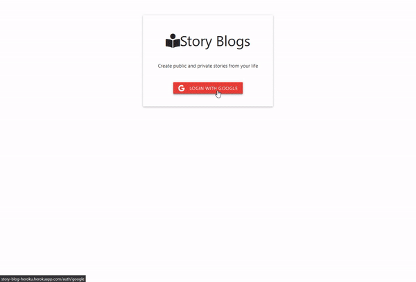

<!--  -->

### 
I am a passionate and self-driven developer with a passion to develop my skills in new technologies and intended to utilize my expertise in my work 👨‍💻, I am motivated by the power of technology as a tool for positive change🚀.

_
See [my website](https://sm-mostafajamal.netlify.app/)  for more information!
_

 

<h1 align="center">Projects</h1>
<table bordercolor="#66b2b2">
  
  <tr>
      <td width="50%" valign="top">
      <h3 align="center">Steadfast Communications</h3>
         
      
         
        

  Client-side         
  
  Server-side         
  
  
      

        
<strong>JavaScript, React, Redux, Redux toolkit, Redux Persist, React-Query, React-Router,Styled-Component, Express.js, Node.js, MongoDB, React-Bootstrap</strong>- Steadfast Communications is the sister concern of Steadfast International Services, LLC. Which is the leading talent acquisition platform that delivers top candidates to enterprises by leveraging the largest community of recruiters and sourcing technology platforms.

    </td>
    <td width="50%" valign="top">
      <h3 align="center"> Story Blog</h3>
         
        
         
        

          
    
  
      

        
<strong>JavaScript, Materialize, EJS, CSS3, Node.js, Express.js & Mongodb</strong>- Platform to create your stories or blog on public or for your personal as private. check the public stories and click on the writers name to read specific writers stories.

    </td>

  </tr>
  
  <tr>
    <td width="50%" valign="top">
      <h3 align="center">My Portfolio</h3>
       
        
       
        

  
  
      

        
<strong>Javascript, React, React Styled-component, React Context API</strong> - Portfolio Site with Dark mode and included links to my projects and ways to get in contact with me.

    </td>
    <td width="50%" valign="top">
      <h3 align="center">Ecommerece</h3>
         
        
         
        

          
  
  
      

        
<strong>"React",
        <!-- // "Redux", -->
      <!-- // "Redux toolkit", -->
      <!-- // "Redux Persist", -->
      <!-- // "React-Query", -->
      "React-Router",
      "Styled-Component",
      <!-- // "Express.js", -->
      <!-- // "Node.js", -->
      <!-- // "MongoDB", -->
      "React-Material-ui"</strong> - Built with MERN stack a responsive website where user has to register or log in so that they can purchase items. Admin can check the users product that they want to purchase also they can check the profile in dashboard.

    </td>
  </tr>
</table>

## 
My Skill Set

          

---

## 
Connect with me

  

