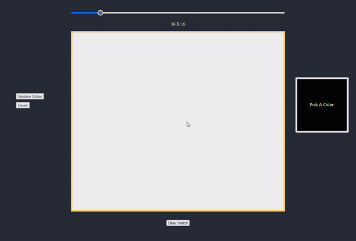

<!--  -->

  

### 
I'm a Full-Stack Software Engineer👨‍💻, I am motivated by the power of technology as a tool for positive change🚀, with a background in Computer Science and Engineering.

   
  

*
Visit [my website](https://sm-mostafajamal.netlify.app/)   for more information!
*  
  

   

<h1 align="center">Projects</h1>
<table bordercolor="#66b2b2">
  
  <tr>
    <td width="50%" valign="top">
      <h3 align="center"> Story Blog</h3>
         
        
         
        

          
    
  
      

        
<strong>JavaScript, Materialize, EJS, CSS3, Node.js, Express.js & Mongodb</strong>- Platform to create your stories or blog on public or for your personal as private. check the public stories and click on the writers name to read specific writers stories.

    </td>
    <td width="50%" valign="top">
      <h3 align="center">WorkLists</h3>
         
      
         
        

          
  
  
      

        
<strong>JavaScript, EJS, CSS3, Node.js, Express.js & Mongodb</strong>- track your work add your task, click and strike if you completed.

    </td>
  </tr>
  
  <tr>
    <td width="50%" valign="top">
      <h3 align="center">My Website</h3>
       
        
       
        

  
  
      

        
<strong>HTML5, CSS3, & Javascript</strong> - Portfolio Site including links to my projects and ways to get in contact with me.

    </td>
    <td width="50%" valign="top">
      <h3 align="center">Mouse Sketch</h3>
         
        
         
        

          
  
  
      

        
<strong>HTML5, CSS3, & Javascript</strong> - With over 100 different cards, test your memory in these three popular trading card themes, Pokemon, Yugioh, & Magic: The Gathering!

    </td>
  </tr>
</table>

 

## 
My Skill Set  
            

---

## 
Connect with me  

  

  